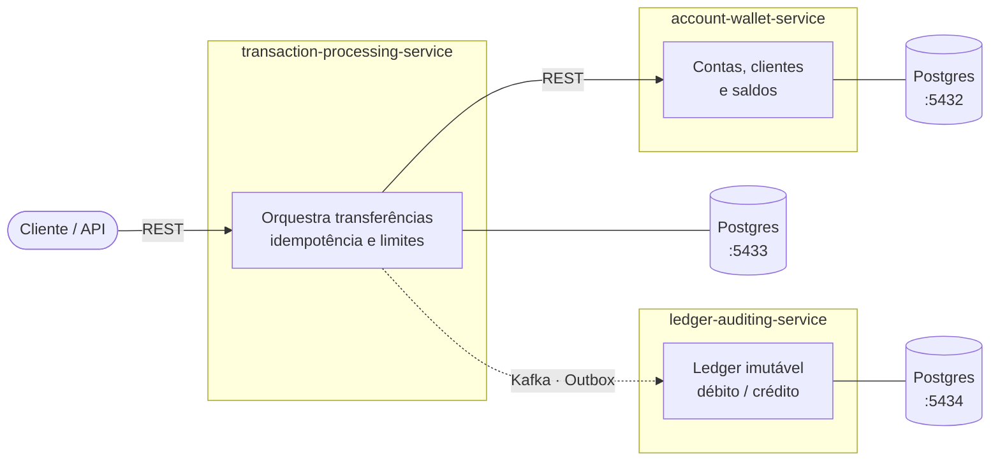

<div align="center">

# 🏦 MV-Banking

**Core Banking & Ledger System construído com microsserviços, Arquitetura Hexagonal e mensageria assíncrona.**

[](https://github.com/MatVicDev/MV-Banking/actions/workflows/ci.yml)


</div>

---

## 📖 Sobre o projeto

O **MV-Banking** é um projeto de portfólio que simula o núcleo de um sistema bancário: abertura de contas, movimentação de saldo, transferências e um livro-razão (*ledger*) imutável para auditoria.

O objetivo é consolidar, em um único sistema coeso, as principais práticas e tecnologias usadas no mercado para sistemas distribuídos — com atenção especial a problemas reais do domínio financeiro:

- 🔒 **Consistência de saldo** sob concorrência (locking otimista/pessimista)
- 🔁 **Idempotência** de transferências via *idempotency keys*
- 📨 **Entrega confiável de eventos** com *Transactional Outbox*, *retry topics* e *DLQ*
- 📚 **Auditoria imutável** com ledger *append-only* de partidas dobradas (débito/crédito)

---

## 🧩 Arquitetura

O sistema é um **monorepo Maven** com três microsserviços Spring Boot, cada um com seu **próprio banco de dados** (*database-per-service*).



| Serviço | Responsabilidade |
|---|---|
| **account-wallet-service** | Ciclo de vida de contas e clientes, depósitos, saques e saldos. Implementado com **Arquitetura Hexagonal pura** — o domínio não depende de nenhum framework. |
| **transaction-processing-service** | Recebe intenções de transferência, valida limites e saldo e garante idempotência. |
| **ledger-auditing-service** | Registra cada movimentação em um ledger *append-only*, garantindo trilha de auditoria íntegra. |

### Arquitetura Hexagonal (account-wallet-service)

```
br.com.mvbanking.accountwallet
├── domain/                 # Regras de negócio em Java puro (sem Spring)
│   ├── account/            # Account, Money, AccountType, AccountStatus
│   └── client/             # Client, CPF, Address, PhoneNumber
└── application/            # Casos de uso
    ├── port/in/            # Portas de entrada (UseCases + Commands)
    ├── port/out/           # Portas de saída (Repositories)
    └── service/            # Implementações dos casos de uso
```

O domínio é modelado com **Value Objects auto-validáveis** e imutáveis (`Money`, `CPF`, `Address`, `PhoneNumber`), garantindo que um objeto inválido nunca exista.

---

## 🛠️ Stack

| Categoria | Tecnologias |
|---|---|
| Linguagem & Framework | Java 21, Spring Boot 4 |
| Persistência | PostgreSQL 16, Spring Data JPA |
| Mensageria | Apache Kafka *(planejado)* |
| Testes | JUnit 5, Testcontainers *(planejado)* |
| Infraestrutura | Docker Compose, Kubernetes *(planejado)* |
| CI/CD | GitHub Actions |

---

## 🚀 Como executar

### Pré-requisitos

- Java 21+
- Docker e Docker Compose

### Passo a passo

```bash
# 1. Clone o repositório
git clone https://github.com/MatVicDev/MV-Banking.git
cd MV-Banking

# 2. Configure as variáveis de ambiente
cp .env.example .env
# edite o .env com nome, usuário e senha de cada banco

# 3. Suba os bancos de dados
docker compose up -d

# 4. Compile e rode os testes
./mvnw clean verify
```

---

## 🗺️ Roadmap

- [x] Estrutura do monorepo e bancos por serviço via Docker Compose
- [x] Pipeline de CI com GitHub Actions
- [x] Domínio do `account-wallet-service` (Account, Client e Value Objects)
- [ ] Casos de uso e portas da camada de aplicação *(em andamento)*
- [ ] Adapters REST e JPA + testes de integração com Testcontainers
- [ ] Controle de concorrência com locking otimista (`@Version`)
- [ ] `transaction-processing-service` com idempotency keys
- [ ] Integração via Kafka com *Transactional Outbox*
- [ ] *Retry topics* e *Dead Letter Queue*
- [ ] Manifests Kubernetes com probes de liveness/readiness

---

## 📄 Licença

Distribuído sob a licença **MIT**. Veja [`LICENSE`](LICENSE) para mais detalhes.

<div align="center">

Feito por **[Matheus Victor](https://github.com/MatVicDev)**

</div>
